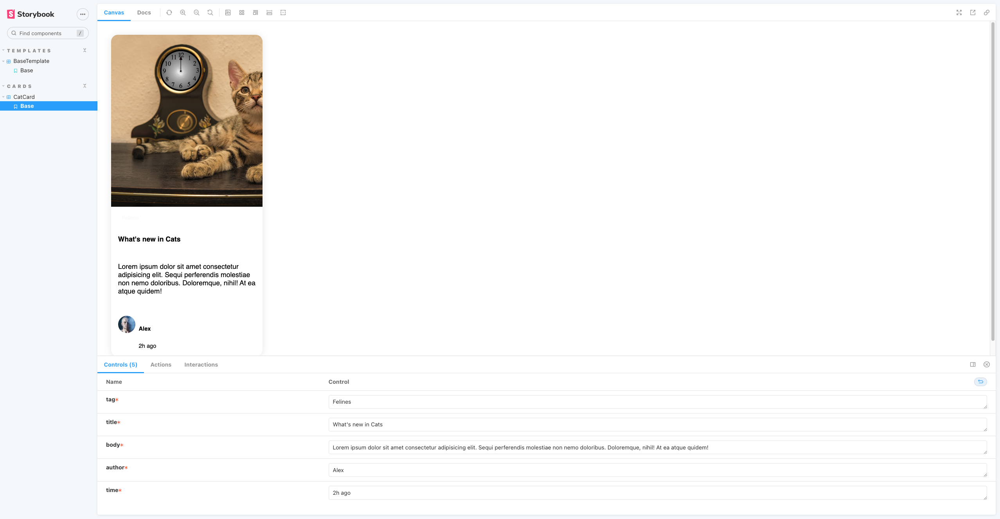

# Micro front end with NextJS version 13

- Lerna
- NextJS
- tailwindcss

# Folder structure

To work on this project, please replicate the following folder structure:

```
 |- /packages
    |- /hub001
    |- /new001
```

## Features of this project

1. This project uses lerna to manage NextJS monorepos
2. This project uses pre-commit: to commit / push on repo, it will automatic use husky to run eslint (cached)
3. Please refer to `commitlint.config.js` to make the massge when `git commit`

---- on going ----
1. chat bot - with ChatGPT (as a customer service)
2. Calendar - with book appointments with clients or staffs
3. 


## Feature of hub001

1. hub to show login/logout
2. header/footer ...
3. general information.
4. hub control style and theme
5. **all files in src/components and src/pages will be share cross the app and other monorepo**

## Style

1. hub001 to control style and theme
2. Can use tailwindcss or css-in-js

## Components

1. Template base && example for components for hub001

```MD
<!-- File Tree -->
components
├─ templates
│  ├─ base
│  │  ├─ BaseTemplate.interface.ts
│  │  ├─ BaseTemplate.mocks.ts
│  │  ├─ BaseTemplate.stories.tsx
│  │  ├─ BaseTemplate.styles.ts
│  │  └─ BaseTemplate.tsx
│  └─ example
│     └─ cards
│        └─ cat
│           ├─ CatCard.interface.ts
│           ├─ CatCard.mocks.ts
│           ├─ CatCard.stories.tsx
│           ├─ CatCard.styles.ts
│           └─ CatCard.tsx
```

2. Example for storybook of CatCard component

<!-- add image in ReadmeImages -->
<p align="center"> 

</p>

## Installation

- root folder:

`yarn && yarn initpakages`

- for run project:
  `yarn hub`
  `yarn news`

## To run the hub:

1- Run the frontend of Hub001 / news001: `yarn hub` / `yarn news`
2- Prettier whole project: `yarn prettier`

## To install a package in a specific module (Frontend):

1- `lerna add [packageName] [pathToModule]`
Example: `lerna add axios packages/hub001/website`

To install a package in all frontend modules:

2- `lerna add [packageName]`
Example: `lerna add axios`
